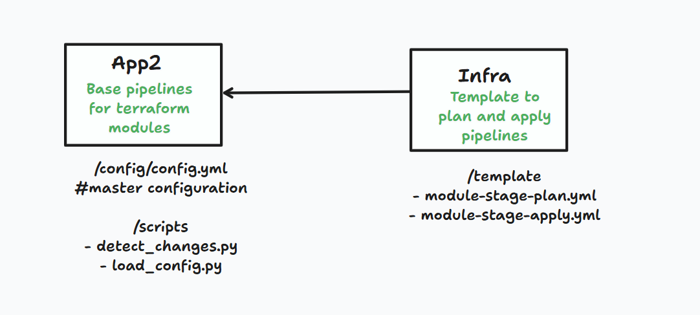

# ADO Pipeline task



## Overview

**ADO Pipeline task** is a modular, scalable Azure DevOps pipeline solution for orchestrating infrastructure and application deployments. It leverages centralized configuration, dynamic change detection, and customizable execution order, making it easy to maintain and extend for evolving project needs.

---

## Features

- **Centralized Configuration:** All modules where file changes are being tracked and ignore paths are managed in `config/config.yml`.
- **Automated Change Detection:** Only modules with detected changes are triggered for deployment.
- **Configurable Execution Order:** Modules run in the order specified in the config file.
- **Ignore Paths:** Exclude files or folders from triggering deployments.
- **Extensible:** Easily add new modules with minimal changes.
- **Cross-Repo Template Support:** Reference pipeline templates from other Azure DevOps repositories (Infra repo).

---

## Directory Structure

```
app2-project-task/
├── ado.yaml                  # Main Azure DevOps pipeline definition
├── config/
│   └── config.yml            # Central architecture diagram
├── scripts/
│   ├── detect_changes.py     # Detects changed modules for deployment
│   └── load_config.py        # Loads modules and config from config.yml
├── templates/
│   └── module-stage.yml      # Pipeline stage template (can be cross-repo)
├── README.md                 # Project documentation
```

---

## Configuration

All pipeline modules and settings are defined in `config/config.yml`. `Ignore_Paths` is also optional.:

```yaml
modules:
  - name: project
    path: project/
  - name: iam
    path: iam/
  # Add more modules as needed

Ignore_Paths:
  - bigquery/
  - scripts/
  - templates/
```

---

## How to Add More Modules

1. **Update `config/config.yml`:**
   ```yaml
   modules:
     - name: bigquery
       path: bigquery/
   order:
     - ... # Add 'bigquery' in the desired position
   ```
2. **Create the Module Directory:**
   ```bash
   mkdir bigquery
   ```
3. **Add Module Logic:**  
   Place your deployment scripts, templates, or Terraform code in the new directory.

4. **Update Pipeline Templates:**  
   Ensure `templates/module-stage.yml` supports the new module.

5. **Commit & Push:**  
   ```bash
   git add config/config.yml bigquery/
   git commit -m "Add bigquery module"
   git push
   ```

---

## Pipeline Usage

- The pipeline is triggered on changes to specified branches.
- `scripts/detect_changes.py` identifies changed modules using `config/config.yml` and ignores paths listed in `Ignore_Paths`.
- Only changed modules are deployed, in the order specified by `order` decided in the pipeline execution condition. `order` in config.yml is for our own references, It never used in the code.

---

## Referencing Templates from Another Repo

If `templates/module-stage.yml` is in another Azure DevOps repo, reference it in `base.yaml` in **app2** project repo like this:

```yaml
resources:
  repositories:
    - repository: templates
      type: git
      name: <project>/<repo-name>
      ref: main

- template: templates/module-stage.yml@templates
  parameters:
    moduleName: 'project'
    changedModulesRef: ...
```
